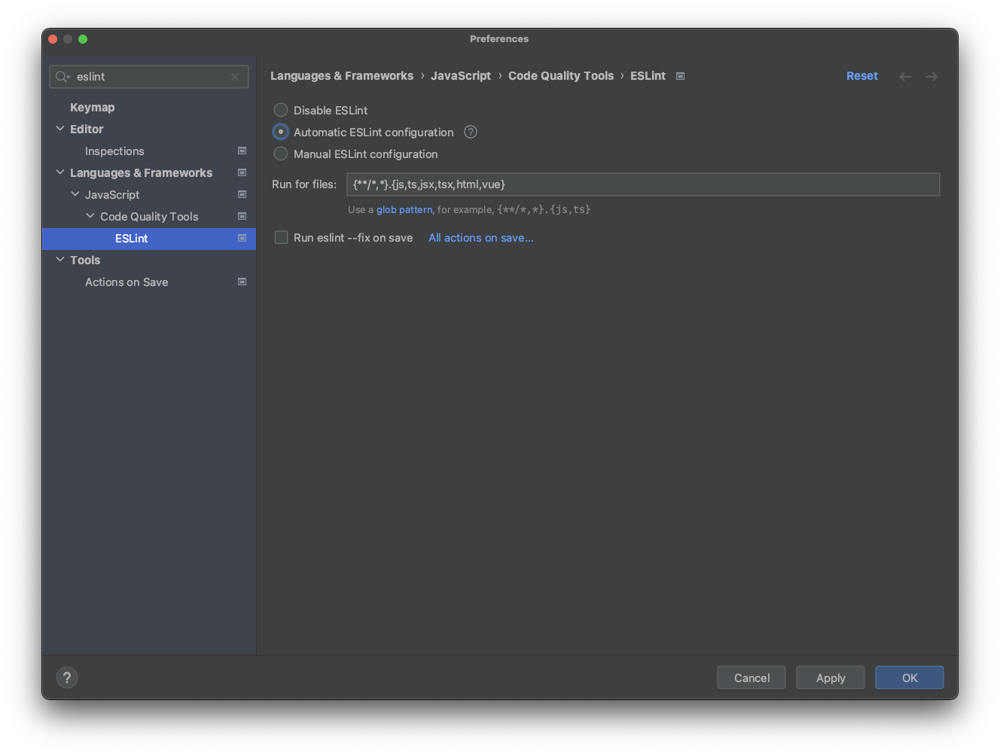
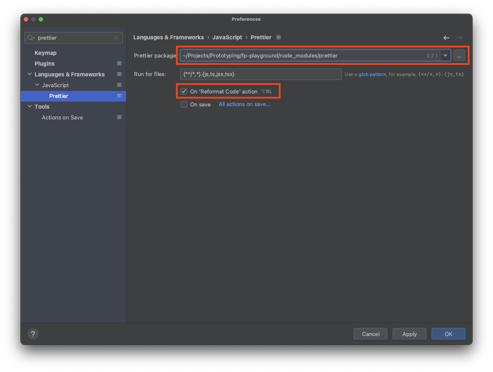

[](https://github.com/google/gts)

# TS Linter and Prettier

Sample project using the Google TS Linter.

## Table of Contents

- [TS Linter and Prettier](#ts-linter-and-prettier)
  - [Table of Contents](#table-of-contents)
  - [Description](#description)
  - [Usage](#usage)
    - [Update `tsconfig.json`](#update-tsconfigjson)
  - [Important files](#important-files)
  - [WebStorm Configuration](#webstorm-configuration)
    - [WebStorm - ESLint](#webstorm---eslint)
      - [WebStorm Configuration steps for ESLint](#webstorm-configuration-steps-for-eslint)
    - [WebStorm - Prettier](#webstorm---prettier)
      - [WebStorm Configuration Steps for Prettier:](#webstorm-configuration-steps-for-prettier)
  - [Visual Studio Code Extensions](#visual-studio-code-extensions)
  - [Package.json Scripts](#packagejson-scripts)

## Description

Setup a project to use the [Google TypeScript Linter and Prettier](https://github.com/google/gts)

## Usage

Please check the [NOTE on tsconfig.json](#note-on-tsconfigjson).

Run the following command from the root of the project directory and follow the prompts. 

```shell
npx gts init
# Initialize Google TypeScript Library
```

The above command will install the `gts` package and create the necessary files to lint and format the project.

> ### Note on tsconfig.json
>
> ## ⛔️ NB: **DO NOT** SELECT YES TO OVERWRITE `tsconfig.json`
>
> &nbsp;

### Update `tsconfig.json`

Add the following line at the start of the `.eslintrc.json` file to your project.

```json
{
  "extends": "./node_modules/gts/tsconfig-google.json",
  ... // Rest of the configuration
}

```

> 📝 NOTE: Replace the `extends` property if it already exists.


## Important files

```
.
├── .editorconfig           # Configuration for code editor
├── .eslintignore           # Folders to ignore for linting
├── .eslint.json            # Linting Rules that inherit node_modules/gts/.eslint.json
├── .prettier.js            # Formatting that inherits node_modules/gts/.prettier.json
└── ...                     # Other project files and folders
```

## WebStorm Configuration

For [WebStorm](https://www.jetbrains.com/webstorm/) users some addition configuration is required.

### WebStorm - ESLint

Open Preferences from `File > Preferences`and search for "eslint". 

#### WebStorm Configuration steps for ESLint
1. Select the "Automatic ESLint configuration" option
2. *[Optionally]* Check the "Run eslint --fix" on save.



> 📖 More information can be found in the [JetBrains Documentation on ESLint for WebStorm](https://www.jetbrains.com/help/webstorm/eslint.html).

### WebStorm - Prettier

Open Preferences from `File > Preferences` and Search for "prettier".

#### WebStorm Configuration Steps for Prettier:

1. From the dropdown, select the prettier folder from the `node_modules` folder for the current project.
   1. Leave the **"run for files"** as its default value
2. Check the **"On 'Reformat Code' action"**  checkbox
3. *[Optionally]* Check the **"On Save"** checkbox




> 📖 More information can be found in the [Prettier documentation](https://prettier.io/docs/en/webstorm.html#jetbrains-ides-webstorm-intellij-idea-pycharm-etc)


## Visual Studio Code Extensions

Ensure the below extensions are installed when using [Visual Studio Code](https://code.visualstudio.com/).

- [ESLint](https://marketplace.visualstudio.com/items?itemName=dbaeumer.vscode-eslint)
- [Prettier](https://marketplace.visualstudio.com/items?itemName=esbenp.prettier-vscode)

## Package.json Scripts 

```json
{
  ...
  "scripts": {
    ...
    "lint": "gts lint",
    "clean": "gts clean",
  }
}
```

The above commands are added by the `gts` package.
